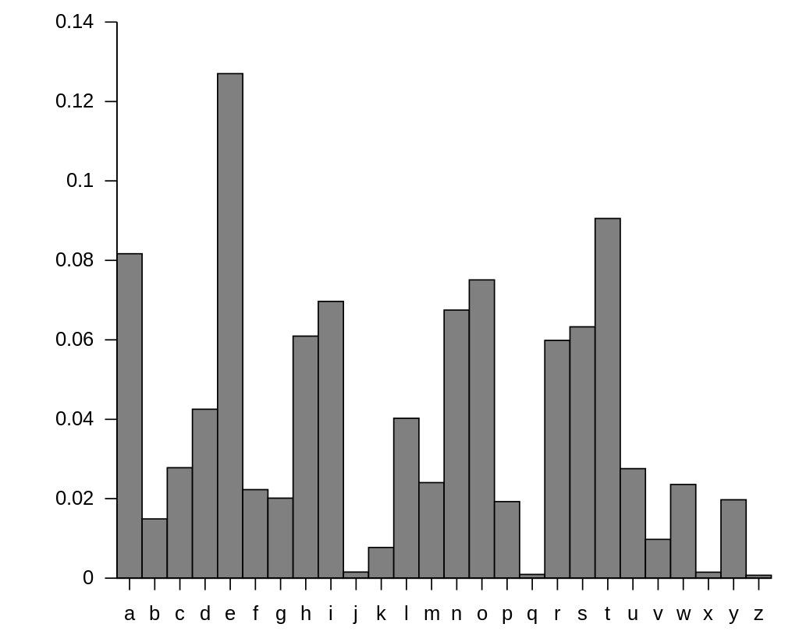

# Lab 5

## Cryptography
As long as people have had secrets, we have devised ways to write them in a way that others cannot read. These secrets are shared in times of war, during attempts to overthrow a government, and today as a routine part of internet communication. Communicating secrets where others may be listening is an age old challenge, made more difficult by the code-cracking abilities of modern computers.

### Mary Queen of Scots
In the late 1500s, Mary Tudor was beheaded by her cousin, Queen Elizabeth of England. Her plot to take the British crown had been uncovered.

Mary believed her messages were secret because of the complex code she used to communicate with her co-conspirators.

### Julius Caesar
The Caesar Cipher works by shifting each letter in a message by a set amount up the alphabet. For example, in a Caesar Cipher with a key (shift) of 3, A -> D and so on, looping around the end so Z -> C.

Take the **CaesarCipher.py** file and examine:
- how it takes input in the ***main()*** function
- how it sends that message to the ***encode()*** function
- how the letter position is determined
- how each letter examined one at a time
- how the key value is added
  - What happens if the letter + key value is outside the alphabet range?
- What happens if the given letter is not in the alphabet?

### Letter Frequency
In an alphabetic substitution cipher, each letter is paired with another letter to form the key. Unlike the Caesar Cipher, there are more possible ways to swap the letters (26! instead of 26). To break this type of cipher, we will analyze the frequency of each letter to see if we can find a relationship to the known frequency of letters in the English language.

#### LetterFrequency.py
- loop through each letter
- Find the position in the alphabet
- Increase the frequency at that position.
  - If position was 5, then frequencies[5] = frequencies[5] + 1

After you have counted how many of each letter are in your message, we will save this info to a .csv file.
Open the file in Excel and create a chart using the data. Save the file with the chart and make sure that it is added to your repl.it files.

### Enigma
During World War II, the Germans used a device known as Enigma to encrypt their messages before they were relayed via radio. Since everyone could hear the radio transmissions, the code needed to be unbreakable.

To break the German code, you would need to have the starting position of the Enigma machine. The position was changed daily so each day was a new challenge to break the code to decrypt their messages.

This is a simplified look at how the Enigma worked.

There are 3 rotors, each with a different mapping of the alphabet. A single letter is passed through each of the three rotors and passed out the other end as a new (encoded) letter.

After each letter, the first rotor is "rotated" one position. After the first rotor has made a full rotation, the second rotor will rotate one position. This process can continue until the second rotor has made a full rotation, at which point the third rotor will rotate one position.

#### BasicEnigma.py
To complete the Enigma program, you will need to do the have each letter of the message go through the following process

- Find the position of the letter in the alphabet.
- Find the letter at that position in Rotor 1
- Find the position of this letter in the alphabet
- Find the letter at that position in Rotor 2
- Find the position of this letter in the alphabet
- Find the letter at that position in Rotor 3
- Use the reflector
- Proceed back through the 3 rotors in reverse order.

After you have passed a letter through the rotors, you should adjust the rotor by rotating it one position. If your message has more than 26 letters, the second rotor will also rotate. If your message has even more letters (more than 676), the third rotor will also rotate once the second rotor finishes a full revolution.

---
## Testing your code
You may not actually know that your code works until you fully test what you have written. It is often a good idea to get someone else to run your program, they may do something you had not anticipated which could show you a possible flaw or at least a design issue.

## End of class
In Repl.it, you will find the share link to your code. That is what gets submitted to Canvas.

### Additional Resources
- [Cracking Codes with Python](http://inventwithpython.com/cracking/)
- [Caesar Cipher](http://practicalcryptography.com/ciphers/caesar-cipher/)
- [NSA Crypto Challenge](https://cryptochallenge.io/)
- [Enigma Rotor Details](https://en.wikipedia.org/wiki/Enigma_rotor_details)
